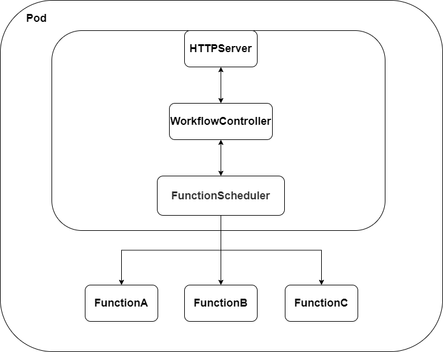
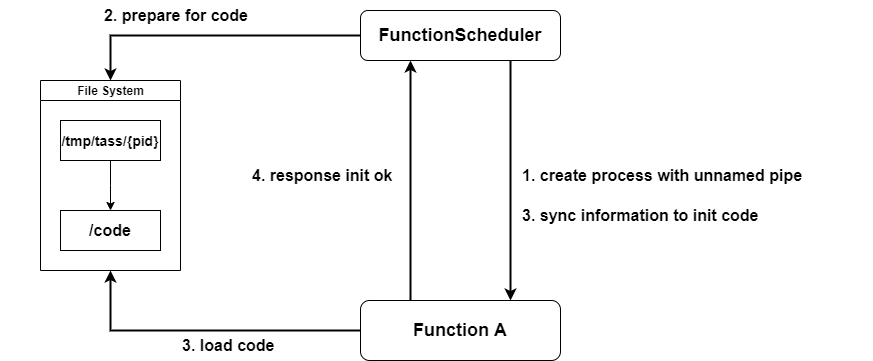

# LocalScheduler

LocalScheduler 负责数据平面对 workflow 的执行，函数的管理。

## Architecture

LocalScheduler 有如下几个模块：

WorkerFlow Controller ：负责从文件或 CRD 获取 workflow 的相关的数据，并执行 WorkerFlow 的相关内容，管理 workflow 的统计数据。

FunctionScheduler：负责与函数代码的存储交互，完成函数注入，管理函数进程，实现 Runner 接口。

HTTPServer：负责对外提供 workflow 的统一服务，接收南北流量和东西流量。

## Execute Path

### 函数本地执行

1. Pod 获取 HTTP Request，请求某个 workflow
2. WorkflowController 处理请求，查询相关 workflow 的内容，创建上下文，调用 FunctionScheduler 开始执行代码
3. FunctionScheduler 将会根据函数名找寻实例进程进行代码的执行，如果没有实例就创建实例进程
4. FunctionScheduler 返回函数执行结果，WorkflowController 对结果结合 workflow 进行处理，进一步继续执行，直到完成 workflow 返回结果

### 函数异地执行

1. Pod 获取 HTTP Request，请求某个 workflow
2. WorkflowController 处理请求，查询相关 workflow 的内容，创建上下文，调用 FunctionScheduler 开始执行代码
3. FunctionScheduler 因为资源不足，没有办法在本地创建进程处理，调用其子模块 LSDS 的函数调用接口
4. LSDS 将会找寻合适 LocalScheduler 调用其 HTTP Server，完成函数调用。
5. 逐步返回回到 WorkflowController，继续 WorkflowController 的流程执行。

## Component Intro

### FunctionScheduler

FunctionScheduler 负责全权管理和使用本地函数进程，并且同步本 LocalScheduler 信息进行全局共享。FunctionScheduler 将管理函数的完整生命周期，这里借鉴了很多 Docker 的代码。

创建函数实例：使用`exec.Command`创建函数，创建同时创建 2 个 unnamed pipe 并给到函数实例(书p56)，在 cmd 启动后获取 process pid，创建`/tmp/tass/{pid}` 文件夹并将代码拷贝进入`/tmp/tass/{pid}/code`

初始化函数实例：函数实例初始化 pipe 的reader 和 writer，各语言的不同方式从 /tmp/tass/{pid}/code load 代码。

工作：FunctionScheduler 通过 unnamed pipe 传递函数参数，在函数处理完成之后，通过 named pipe 回传数据，整个数据链路中将携带请求的uuid。

销毁：FunctionScheduler 给函数实例发送 SIGTERM，关闭管道，函数实例在完成最后的工作之后，关闭管道，并且删除文件夹/tmp/tass/{pid}再exit。

#### LSDS

负责更新本 LocalScheduler 的 `WorkflowRuntime` 并 watch 其他 LocalScheduler 对应的 `WorkflowRuntime`，该资源将描述 LocalScheduler 的 uuid，拥有函数的情况，LSDS 也实现 Runner 接口，协助远程调用，跟 K8S 相关的内容都会存在与该系统中。

