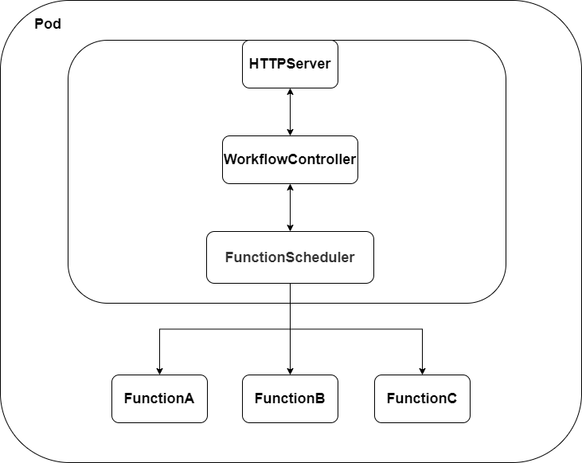
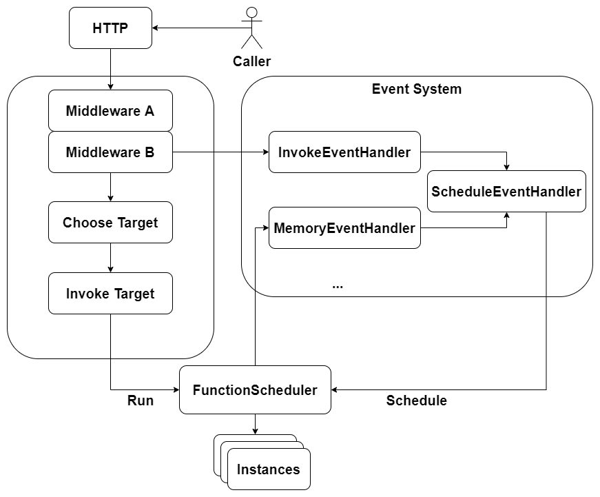

# LocalScheduler

LocalScheduler 负责数据平面对 Workflow 的执行，函数的管理。

## Architecture

LocalScheduler 有如下几个模块：

* `WorkerFlowController` ：负责从文件或 CRD 获取 Workflow 的相关的数据，并执行 WorkerFlow 的相关内容，管理 Workflow 的统计数据。

* `FunctionScheduler`：负责与函数代码的存储交互，完成函数注入，管理函数进程，实现 Runner 接口。

* `HTTPServer`：负责对外提供 Workflow 的统一服务，接收南北流量和东西流量。




## Execute Path

### Function Local Execution

1. Pod 获取 HTTP Request，请求某个 workflow；
2. `WorkflowController` 处理请求，查询相关 Workflow 的内容，创建上下文，调用 `FunctionScheduler` 开始执行代码；
3. `FunctionScheduler` 将会根据函数名找寻实例进程进行代码的执行，如果没有实例就创建实例进程； 
4. `FunctionScheduler` 返回函数执行结果，`WorkflowController` 对结果结合 Workflow 进行处理，进一步继续执行，直到完成 Workflow 返回结果。

### Function Remote Execution

1. Pod 获取 HTTP Request，请求某个 workflow；
2. `WorkflowController` 处理请求，查询相关 Workflow 的内容，创建上下文，调用 `FunctionScheduler` 开始执行代码；
3. `FunctionScheduler` 因为资源不足，没有办法在本地创建进程处理，调用其子模块 LSDS 的流程调用接口；
4. LSDS 将会找寻合适 `LocalScheduler` 调用其 HTTP Server，完成流程调用；
5. 逐步返回回到 `WorkflowController`，继续 `WorkflowController` 的流程执行。

## Component Intro

### FunctionScheduler


`FunctionScheduler` 负责全权管理和使用本地函数进程，并且同步本 `LocalScheduler` 信息进行全局共享。`FunctionScheduler` 将管理函数的完整生命周期，这里借鉴了很多 Docker 的代码。

* 创建函数实例：使用 `exec.Command` 创建函数，创建同时创建 2 个 unnamed pipe 并给到函数实例（书 P56），在 cmd 启动后并非直接进入函数实例的进程，而是进入 `scheduler init`, InitCmd 获取 process pid，创建 `/tmp/tass/{pid}`  文件夹并将代码拷贝进入 `/tmp/tass/{pid}/code`，并进行一些其他的初始化工作，最后执行 `syscall.Exec`；

* 初始化函数实例：函数实例初始化 pipe 的 `reader` 和 `writer`，各语言的不同方式从 `/tmp/tass/{pid}/code` load 代码。

* 工作：`FunctionScheduler` 通过 unnamed pipe 传递函数参数，在函数处理完成之后，通过 named pipe 回传数据，整个数据链路中将携带请求的 uuid；

* 销毁：`FunctionScheduler` 给函数实例发送 `SIGTERM`，关闭管道，函数实例在完成最后的工作之后，关闭管道，并且删除文件夹 `/tmp/tass/{pid}` 再 exit。

#### LSDS

负责更新本 `LocalScheduler` 的 `WorkflowRuntime` 并 watch 其他 `LocalScheduler` 对应的 `WorkflowRuntime`，该资源将描述 `LocalScheduler` 的 uuid，拥有函数的情况，LSDS 也实现 `Runner` 接口，协助远程调用，跟 K8S 相关的内容都会存在与该系统中。

### Extension
#### Scale
`FunctionScheduler` 更多的是一些能力的实现，这些能力的调用将被抽象以保证后续试验的简便实施和改装，因此决定 FunctionScheduler as strategy。Policy 方面通过可扩展的方式实现。

Local Scheduler 计划实现 Middleware 和 EventHandler 分别作为同步和异步处理的两种支持方式，两种实现都在 Manager 的概念中完成。


上图从一次 Local Scheduler 接受请求的角度描述处理流程，`Middleware` 和 `EventHandler` 两个部分实际是会内置一些实现，这些实现就是 strategy 的部分，例如 `Middleware` 中会植入使用 LSDS 完成调用的情况。`Middleware` 使用 priority table 以确定执行的先后顺序，通过描述切入点以支持在请求前和请求后进行处理。

Event System 部分以 `InvokeEventHandler` 为例，他将收集调用的 qps，以计算自己认为合理的函数实例数量，从而向 `ScheduleEventHandler` 发出 Event。`EventHandler` 的 Event 来源非常广泛，可以来自 HTTP request， 可以来自外部的请求，因此可扩展能力很强。

`ScheduleEventHandler` 是一个特殊的 `EventHandler` 它特殊就特殊在他是所有的Event 的下游，并最终调用 `FunctionScheduler` 的相关接口。

`ScheduleEventHandler` 对每个函数都有一个 priority table，各上游状态意见和 priority table 以确定最终意见。

例如现在有如下的 priority table：
```json
{
    "invoke": 1,
    "memory": 2,
}
```
并且同时存在如下的上游状态意见：
```json
{
    "invoke": {"trend": "increase", "function": "a", "num": 2},
    "memory": {"trend": "decrease", "function": "a", "num": 1}
}
```
因为 `invoke` 的优先级高，最终 a 函数实例的最终期望为2，当然也保证最大包容原则：
```json
{
    "invoke": {"trend": "increase", "function": "a", "num": 1},
    "memory": {"trend": "increase", "function": "a", "num": 2}
}
```
此时虽然 `invoke` 优先级更高，但是它与 `memory` 是一个可兼容向，因此此时 a 函数实例的最终期望为 2。

`FunctionScheduler` schedule 实例的接口的输入一定是期望值，而非绝对值。