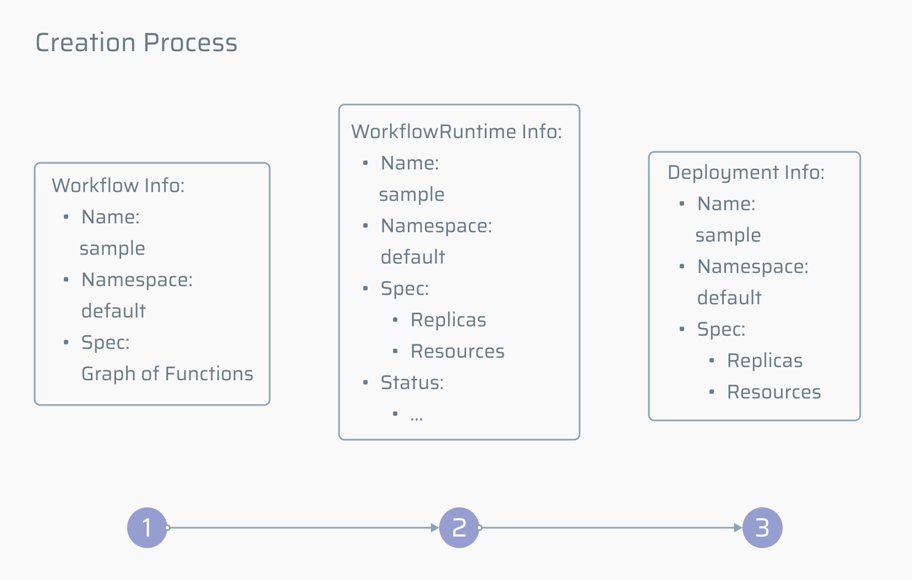
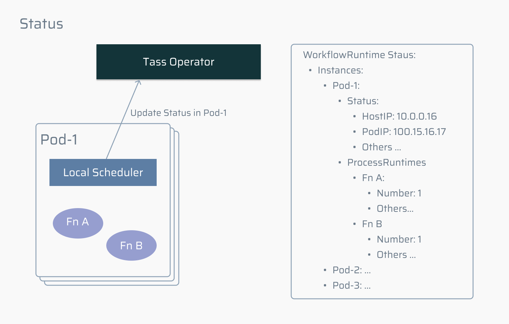
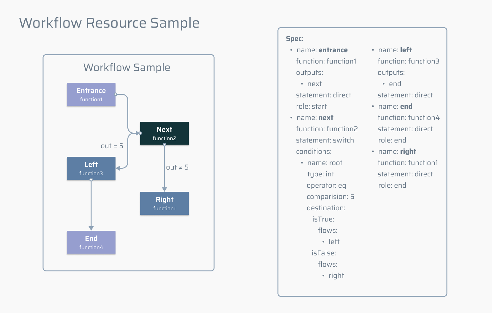
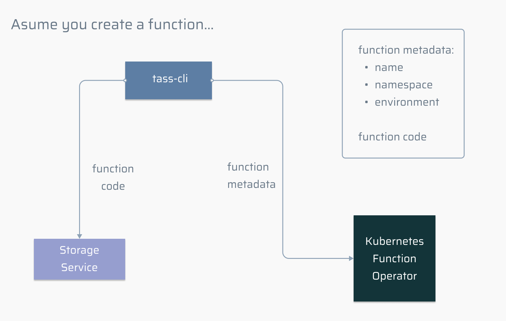

# Tass Operator Design


| Components | Features                                                     | Data Structures                                              | Remarks |
| ---------- | ------------------------------------------------------------ | ------------------------------------------------------------ | ------- |
| Operator   | 1. 负责业务流程的定义，负责函数的定义；<br>2. 知识共享；<br>3. Controller；<br>4. HTTP Triger。 | 1. Function / Workflow 数据结构；<br>2. 分支跳转的数据和知识利用率相关数据 |         |

## Core Concepts

### Main CRD

在 Kubernetes 集群中，主要有三种类型的 CRD 会通过 Tass Operator 进行管理：

* `Function` CRD：Function 用来定义 Tass 中最小的执行单位，在 Tass 中，每个用户可以定义多个 Function，这些 Function 就是一段代码片段，Tass 会在一些合适的时间点执行这些代码。多个不同的 Function 可以组成一个 Workflow；
* `Workflow` CRD：Workflow 是多个 Function 逻辑的组合，它不仅描述了 Function 链式调用，同时还描述了一些循环，switch 的情况。
* `WorkflowRuntime` CRD：WorkflowRuntime 是 Workflow 的实际执行，当用户创建了一个 Workflow Resource 的时候，Tass 会自动创建一个对应的 WorkflowRuntime。Workflowruntime 用来真正管理 Workflow 实例。

可以通过以下几个图具体描述上述三个 CRD 各个之间的关系，下图展示了 Function 和 Workflow 之间的关系：


1. 一个用户可以定义多个 Function，每个 Function 在这个用户下通过 name 唯一标识；
2. 一个用户可以定义多个 Workflow，每个 Workflow 由其定义的 Function 组成：
   1. 一个 Function 可以被多个 Workflow 使用；
   2. 一个 Function 可以在一个 Workflow 下多次使用；
   3. 一个 Workflow 中 的 Function 在处理完数据后会涉及几种情况，选择，循环，或直接往下游发送。

下图展示了 Workflow 和 WorkflowRuntime 之间的关系：


1. 一个 Workflow 是各个 Function 逻辑上的集合；一个 WorkflowRuntime 是这个 Workflow 的运行时；
2. 当一个 Workflow Resource 被创建的时候，会对应创建一个 WorkflowRuntime Resource；
3. 当一个 WorkflowRuntime Resource 创建的时候，会对应创建一个 Deployment Resource；
4. WorkflowRuntime Resource 记录着该 Workflow 运行时的各种资源信息，比如每个 Pod 的状态，Function 的状态等。

### Sample

下面将介绍当创建一个类型为 `Workflow` 的资源时集群发生的变化。

首先，假设创建的资源配置文件如下：

```yaml
apiVersion: serverless.tass.io/v1alpha1
kind: Workflow
metadata:
  name: workflow-sample
spec:
  spec: # 某几个的 function
```

目前，tass 使用 Kubernetes Namespace 区别用户，因此，上述文件的用户为 default。该文件表明，当前定义的 `Workflow` 的名字为 `workflow-sample`。当用户在集群中创建这个资源后，Tass Operator 会**按序**创建相关资源 WorkflowRuntime 和 Deployment，如下图：



Workflow，WorkflowRuntime 和 Deployment 创建的资源具有相同的名字和 namespace，只是他们各自扮演的角色并不相同：

* Workflow 可以理解为一份配置文件，是 Workflow resource 的 metadata，记录着 Function 构成的图；
* WorkflowRuntime 是 Workflow 资源的运行时，在 Workflow Resource 创建完成后创建，它负责记录两件事：
  * 真正要部署的 Deployment 副本数量和资源限制，如运行 2 个 Pod，每个 Pod 资源占用 1 个 CPU 2GB 的内存；
  * 真正在集群中运行的 Pod 的各类信息，如 Pod 的创建时间，Pod 的 IP，Pod 中运行的 Function 的信息；
* Deployment 用来真正进行资源部署，在 WorkflowRuntime Resource 创建完成后创建，它根据 WorkflowRuntime 的信息动态的调整 Pod 的数量；
* Tass 具有资源池的概念，每个 Workflow 创建的时候都会预启动对应的资源池，这保证了更低的冷启动。

对于每一个运行的 Pod，其内部有一个 Local Scheduler 的进程负责启动 Function Process 和上报资源信息，假设一个 `workflow-sample` 相关的 HTTP 请求发往 Tass，这条请求会通过 Tass 转发到一个具体的 Pod 下，Pod 下的 Local Scheduler  就会启动 Workflow 下的相关 Function 的进程，并将状态上报给对应的 WorkflowRuntime Resource，此时集群可能的状态如下图：



## CRD Types

### Workflow Definition

#### `WorkflowSpec`

| Field | Type     | Description                                                  |
| ----- | -------- | ------------------------------------------------------------ |
| Spec  | `[]Flow` | Spec is a list of Flows                                      |
| Env   | `Env`    | Env is the environment variables for the Workflow which is defined by users |

#### `Flow`

| Field      | Type           | Description                                                  | Required |
| ---------- | -------------- | ------------------------------------------------------------ | -------- |
| Name       | `string`       | Name is the name of the flow which is unique in a workflow.  | True     |
| Function   | `Function`     | Function is the function name which has been defined in Tass | True     |
| Outputs    | `[]string`     | Outputs specify where the result of this flow should go      | False    |
| Statement  | `Statement`    | Statement shows the flow control logic type                  | True     |
| Role       | `ROle`         | Role is the role of the Flow                                 |          |
| Conditions | `[]*Condition` | Conditions are the control logic group of the flow. The first element of the Conditions is the root control logic | False    |

#### `Statement`

```go
// Statement shows the flow control logic type
type Statement string

const (
	// Direct is the result of the flow go to downstream directly
	Direct Statement = "direct"
	// Switch is the result of the flow go to downstream based on the switch condition;
	Switch Statement = "switch"
)
```

#### `Role`

```go
// Role is the role of the Flow
// +kubebuilder:validation:Enum=start;end
type Role string

const (
	// Start means the role of the Flow is "start" which means it is the entrance of workflow instance
	Start Role = "start"
	// End means the role of the Flow is "end" which means it is the exit point of workflow instance
	End Role = "end"
	// Orphan means the role of the Flow is "orphan" which is a special case that
	// the workflow instance has only one function
	Orphan Role = "orphan"
)
```

#### `Condition`

| Field       | Type            | Description                                                  |
| ----------- | --------------- | ------------------------------------------------------------ |
| Nmae        | `string`        | Name is the name of a Condition, it's unique in a Condition group |
| Type        | `ConditionType` | Type is the data type that Tass workflow condition support   |
| Operator    | `OperatorType`  | Operator defines the illegal operation in workflow condition statement |
| Target      | `string`        | Target shows the specific data that the flow result uses to compare with. The result of the flow can be a simple type like string, bool or int. But it can also be a complex object contains some fileds. Whatever the result is, the Flow runtime will wrap the result to a JSON object to unifiy the transmission process. |
| Comparision | `Comparision`   | Comparision is used to compare with the flow result          |
| Destination | `Destination`   | Destination defines the downstream Flows based on the condition result |

#### `ConditionType`

```go
// ConditionType is the data type that Tass workflow condition support
type ConditionType string

const (
	// String means the condition type is string
	String ConditionType = "string"
	// Int means the condition type is int
	Int ConditionType = "int"
	// Bool means the condition type is boolean
	Bool ConditionType = "bool"
)
```

#### `OperatorType`

```go
// OperatorType defines the illegal operation in workflow condition statement
type OperatorType string

const (
	// Eq means the result is equal to the target
	Eq OperatorType = "eq"
	// Ne means the result is not equal to the target
	Ne OperatorType = "ne"
	// Lt means the result is less than the target, bool not accept
	Lt OperatorType = "lt"
	// Le means the result is less than or equal to the target, bool not accept
	Le OperatorType = "le"
	// Gt means the result is greater than the target, bool not accept
	Gt OperatorType = "gt"
	// Ge means the result is greater than or equal to the target, bool not accept
	Ge OperatorType = "ge"
)
```

#### `Comparision`

```go
// Comparision is used to compare with the flow result
// Comparision can be string, int or bool
// TODO: Validation needed
type Comparision string
```

#### `Destination`

| Field   | Type   | Description                                                  |
| ------- | ------ | ------------------------------------------------------------ |
| IsTrue  | `Next` | IsTrue defines the downstream Flows if the condition is satisfied |
| IsFalse | `Next` | IsFalse defines the downstream Flows if the condition is not satisfied |

#### `Next`

| Field      | Type           | Description                                                  |
| ---------- | -------------- | ------------------------------------------------------------ |
| Flows      | `[]string`     | Flows lists the Flows where the result of the current Flow goes |
| Conditions | `[]*Condition` | Condition lists the Condition where the result of the current Flow goes. It means that the result needs more control logic check |

#### Sample

一个 Workflow 的示例如下，该文件完整定义见[此](https://raw.githubusercontent.com/tass-io/tass-operator/main/config/samples/serverless_v1alpha1_workflow.yaml)：



### Function Definition

#### `FunctionSpec`

| Field       | Type          | Description                                                  |
| ----------- | ------------- | ------------------------------------------------------------ |
| Environment | `Environment` | Environment represents the language environment of the code segments, the scheduler wil then launch the corresponding language environment |
| Resource    | `Resource`    | Resource claims the resource provisioning for Function process, it now contains cpu and memory. |

#### `Environment`

```go
// Environment defines the language environments that tass supports
type Environment string

const (
	// Golang means the language environment is Golang
	Golang Environment = "Golang"
	// Python means the language environment is Python
	Python Environment = "Python"
	// JavaScript means the language environment is JavaScript
	JavaScript Environment = "JavaScript"
)
```

#### `Resource`

```go
// Resource claims the resource provisioning for Function process
type Resource struct {
	Cpu    string `json:"cpu"`
  Memory string `json:"memory"`
}
```

### WorkflowRuntime Definition

> 会在字段定义相对稳定后更新。

## Cli

Cli 主要负责以下功能：

* Function 的增删改查以及测试一个 Function 是否可正常运行；
* todo...

下图展示了创建一个 Function 涉及的主要流程：



* 用户输入 `tass function create --name sample --ns default --env golang --code sample.go`；
* Cli 根据 code 参数指定的位置寻找对应代码文件，将文件存储至对应存储服务中；
* Cli 根据剩余参数将 Function Metadata 发送至集群的 Function Operator，由 Operator 负责后续对应 Function 的创建。

## Guide

### Kubebuilder

目前打算使用 Kubebuilder 来构建 Controller，拟采用的版本是 [v2.3.1](https://github.com/kubernetes-sigs/kubebuilder/releases/tag/v2.3.1)。本质上来说，Kubebuilder 是 Kubernetes Operator 的一套构建工具，通过使用 `kubebuilder` cli 来自动生成一些代码，

Kubebuilder 的简单使用：

1. 创建一个新的 crd：

   ```bash
   $ kubebuilder create api --group serverless --version v1alpha1 --kind Sample
   ```

   它会创建一个 `apiVersion` 为 `serverless.tass.io/v1alpha1` ，`kind` 为 `Sample` 的 crd；

2. 每次对 crd 定义文件（形如 `xxx_types.go`）的更新都需要 `make install`；

3. 启动 controller 的命令为 `make run`。

目前已收集到的可能对于开发 Kubebuilder 有帮助的教程：

* 官方 Cronjob Tutorial：[EN](https://book.kubebuilder.io/cronjob-tutorial/cronjob-tutorial.html) & [CH](https://cloudnative.to/kubebuilder/cronjob-tutorial/cronjob-tutorial.html)
  * 中文版和原文比有几处小出入，建议搭配原文；
  * 原文根据代码自动生成，可以直接参考官方 repo 示例中的代码（注意将分支调整为 v2）；
  * 已知该 Tutorial 安装 CRD 时会遇到的问题：[CronJob make install failed](https://github.com/kubernetes-sigs/kubebuilder/issues/1466)；
  
* [深入解析 Kubebuilder](https://juejin.cn/post/6844903952241131534)：介绍了 Kubebuilder 关键组件的作用；

* [熟悉又陌生的 k8s 字段：finalizers](https://developer.aliyun.com/article/772044)：Finalizers 的使用介绍；

* [kubebuilder 2.0 学习笔记——进阶使用](https://segmentfault.com/a/1190000020359577)：包括 finalizer、Controller 对 CRD 的 update status、kubebuilder 注释等；

* [Kubebilder Resource Management](https://github.com/kubernetes-sigs/kubebuilder/pull/2000/files): 包括由 manager 本身创建的资源的 watch 和对外部资源创建的 watch；

* K8S Patch：

  * [K8S client-go Patch example](https://developer.aliyun.com/article/703438)

  * [jsonpatch.com](http://jsonpatch.com/)

* 其他一些在 Github 上的 Sample：[jetstack](https://github.com/jetstack)/**[kubebuilder-sample-controller](https://github.com/jetstack/kubebuilder-sample-controller)**，[ishankhare07](https://github.com/ishankhare07)/**[kubebuilder-controller](https://github.com/ishankhare07/kubebuilder-controller)** 和对应的[文章](https://dev.to/ishankhare07/writing-a-simple-kubernetes-controller-in-go-with-kubebuilder-ib8)；[tkestack](https://github.com/tkestack)/**[elastic-jupyter-operator](https://github.com/tkestack/elastic-jupyter-operator)**。

### Communicate with Kubernetes

#### Controller-runtime

在以往的方法中，通常使用 code-gen 来生成一个 crd 对应的 CRUD 代码，然后通过调包更新 resource，在 controller-runtime 的包加入后，可以使用 controller-runtime 中的 [client](https://pkg.go.dev/sigs.k8s.io/controller-runtime@v0.8.3/pkg/client#Client) 统一的进行各类资源的修改（比如，[create](https://pkg.go.dev/sigs.k8s.io/controller-runtime@v0.8.3/pkg/client#example-Client-Create)），只需要在初始化这个 client 时注册对应类型的 scheme。比如，如果想获取一个自定义的 Function CRD 的相关代码如下：

```go
package main

import (
	"k8s.io/apimachinery/pkg/runtime"
	"sigs.k8s.io/controller-runtime/pkg/client/config"
	"sigs.k8s.io/controller-runtime/pkg/client"
	serverlessv1alpha1 "github.com/tass-io/tass-operator/api/v1alpha1"

)

func main() {
  var c *client.Client
  scheme := runtime.NewScheme()
  serverlessv1alpha1.AddToScheme(scheme)
  cl, _ := client.New(config.GetConfigOrDie(), client.Options{Scheme: scheme})
  
  fn := *serverlessv1alpha1.Function{}
  cl.Get(context.Background(), client.ObjectKey{
		Namespace: "default",
		Name:      "hello",
	}, fn)
}
```


